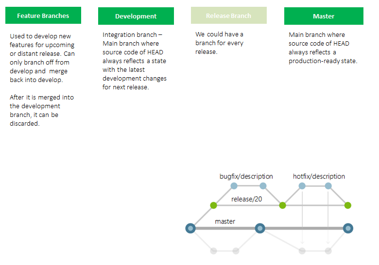

# Intro to Git

---?color=linear-gradient(90deg, #E27924 65%, white 35%)
@title[What is git?]

@snap[north-west h4-white]
@snapend

@snap[east span-45]
@img[shadow](assets/img/gitlogo.png)
@snapend
@snap[west span-55]
@ul[spaced text-white]
- A system that keeps record of your changes
- Collaborative development environment
- Transparency of who made changes
- Allows you to go (revert) back to previous versions
@ulend
@snapend

@snap[east span-45]
@img[shadow](assets/img/gitlogo.png)
@snapend

---

@snap[west span-100]
@ul[spaced text-black]
#### What is git?
- 2005
- Linus Torvald to aid Linux kernel development
- Not the only version control system (e.g Subversion)...but probably the best (and most universal)!
@ulend
@snapend

---
#### Companies that use git

---?color=#E27924 

@snap[west span-100 h4-white]
@ul[spaced text-white]
#### Repositories (or repos)
- A collection of all of the files related to your project
- All of the history associated with these files
- Local (on your machine) or on remote server (in GitHub)
@ulend
@snapend

--- 

@snap[west span-100 h4-#E27924]
@ul[spaced text-black]
#### Commits
- A commit is like 'save' (but not the same)
- You are creating a snapshot
- Cumulative commits make up a project
- You 'commit' changes (example)
@ulend
@snapend

---

@snap[west span-100 h4-black]
@ul[spaced text-black]
#### Branches
- A divergence from the main branch of development
- Master is also a branch
- Branching strategies - we use feature branching for Azure DevOps
- Branch policies 
@ulend
@snapend

---
#### Feature Branching strategy
@img[shadow](assets/img/gitbranch.PNG)
@snapend

---?color=#E27924 
#### Pull Requests
- Share your code changes with colleagues
- Request changes to be merged with another branch (usually dev or master)
- Changes can be peer reviews (you can set rules)

---

---

#### Install git and create GitHub account

---

---

---

---?code=code

@snap[south span-100]
@ul[spaced text-white] 
- https://git-scm.com/downloads

---?code=gitcode_global

---

---

---

---

---

---?color=#E27924 

### Live Demo (Databricks)

---?image=assets/img/presenter.jpg

@snap[north span-100 h2-white]
## Questions?
@snapend

@snap[south span-100 text-06]
[Click here to jump straight to github @fa[external-link]](https://github.com)
@snapend
